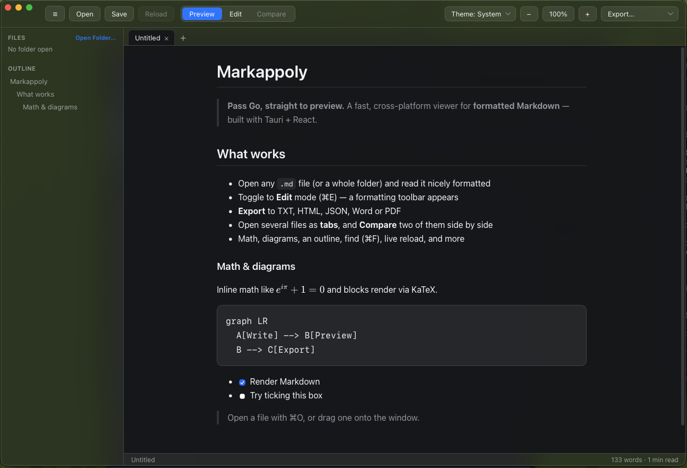

<p align="center">
  
</p>

<p align="center"><em>Pass Go, straight to preview.</em></p>

<p align="center">
  <a href="https://github.com/appoly/markappoly/releases/latest"></a>
  <a href="https://github.com/appoly/markappoly/wiki"></a>
  
  <a href="LICENSE"></a>
</p>

# Markappoly

A desktop app that opens Markdown files and shows them formatted, the way they're meant to look. Double-click a `.md` and you're reading it, not staring at raw `#` and `*`. When you do need to change something, one key flips you into an editor and back.

It's built with Tauri and React, so the download is small and it feels like a real Mac app rather than a web page in a window. Windows and Linux builds come from the same code.

## Screenshot

<p align="center">
  
</p>

## Download

Grab the installer for your platform from the [latest release](https://github.com/appoly/markappoly/releases/latest):

On **macOS**, download the `.dmg`, open it, and drag Markappoly into Applications. The build is signed and notarized by Apple, so it opens without security warnings.

On **Windows**, download and run the `.msi`.

On **Linux**, download the `.AppImage` (make it executable, then run it) or install the `.deb`.

After the first launch the app keeps itself up to date: when a new version ships it asks before downloading, then restarts into the new one.

## Features

**Reading**
- Formatted preview by default, with GitHub-flavored Markdown: tables, task lists, strikethrough
- Syntax-highlighted code, **KaTeX math**, and **Mermaid diagrams**
- Outline sidebar and folder browser, find-in-document (⌘F), word count and reading time
- Live reload when the file changes on disk

**Editing**
- One key flips between the preview and a CodeMirror source editor with a formatting toolbar
- Tick a checkbox in the preview and it writes the change back to the source

**Export:** Text, HTML, JSON (AST), **Word (.docx)**, and PDF.

**Native polish:** frosted vibrancy on macOS and acrylic on Windows, system/light/dark themes, a native menu bar, drag-and-drop, "open with" file association, and a window that reopens where you left it.

For a walkthrough of every feature, see the **[user manual](https://github.com/appoly/markappoly/wiki)**.

## Keyboard shortcuts

| Action | Shortcut | Action | Shortcut |
| ------ | -------- | ------ | -------- |
| Open | ⌘O | Find | ⌘F |
| Open folder | ⌘⇧O | Toggle edit/preview | ⌘E |
| Save | ⌘S | Toggle sidebar | ⌘\ |
| Reload from disk | ⌘R | Zoom | ⌘+ / ⌘- / ⌘0 |
| Bold / Italic | ⌘B / ⌘I | Link | ⌘K |

## Build from source

For contributors. You'll need **Node 18+**, **Rust** (via [rustup](https://rustup.rs)), and your platform's [Tauri prerequisites](https://tauri.app/start/prerequisites/).

```bash
npm install
npm run tauri dev      # run the app with hot reload
npm run tauri build    # produce a native installer for your OS
```

**[DISTRIBUTION.md](DISTRIBUTION.md)** covers signing, notarization, the app icon, and auto-updates.

**Stack:** React + TypeScript + Vite · Tauri v2 (Rust) · unified/remark/rehype · CodeMirror 6 · KaTeX · Mermaid · `remark-docx`

## License

[MIT](LICENSE) © Appoly Ltd

---

<p align="center"><sub>Built by Appoly · "Do not pass Go, just preview your markdown."</sub></p>
